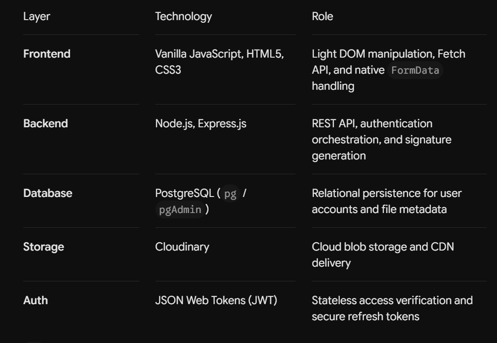
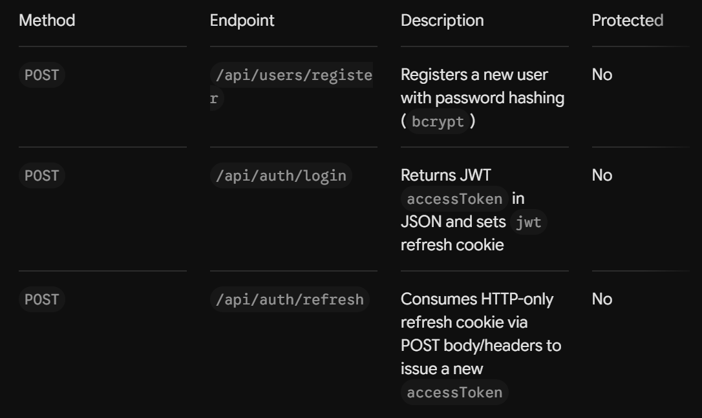
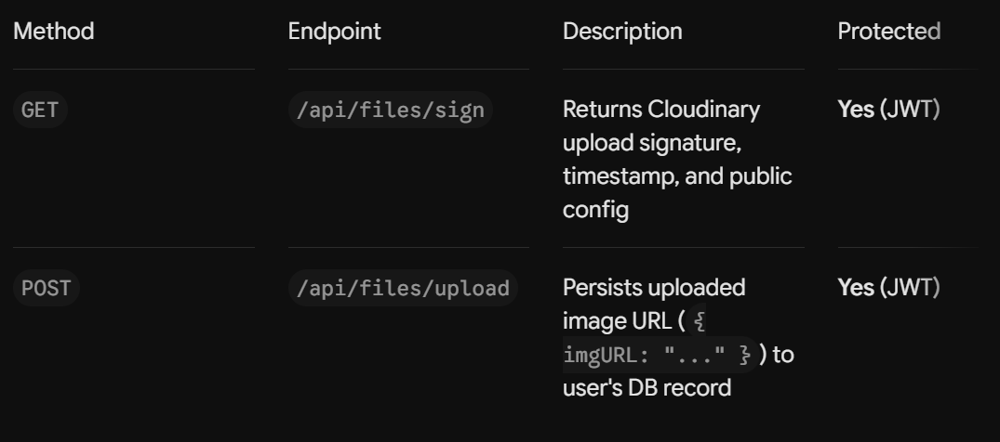

-----------------------------------------------------------------------------------------------
Core Achievements
-----------------------------------------------------------------------------------------------

- Zero-Payload Server Routing: Binary file data streams directly from the client browser to Cloudinary's edge servers.

- Strict Secret Isolation: Cloudinary API secrets never leave the backend; all client-side uploads are authorized via short-lived cryptographic signatures.

- Dual-Token Authentication: Secure authentication using short-lived JWT Access Tokens (Bearer) paired with HTTP-only, secure Cookie-based Refresh Tokens.

-----------------------------------------------------------------------------------------------
The Direct Upload Architecture
-----------------------------------------------------------------------------------------------

+---------+              +-------------------+              +------------+
| Client  |              |  Node.js Backend  |              | Cloudinary |
+----+----+              +---------+---------+              +-----+------+
     |                             |                              |
     |  1. POST /auth/login        |                              |
     +---------------------------->|                              |
     |<----------------------------+                              |
     |     Returns Access Token    |                              |
     |                             |                              |
     |  2. GET /files/sign (JWT)   |                              |
     +---------------------------->|                              |
     |<----------------------------+                              |
     |     Returns Signature,      |                              |
     |     Timestamp & API Key     |                              |
     |                             |                              |
     |  3. POST FormData (File + Sig + API Key)                   |
     +----------------------------------------------------------->|
     |<-----------------------------------------------------------+
     |     Returns Public Image URL                               |
     |                             |                              |
     |  4. POST /files/upload      |                              |
     |     { imgURL: "..." } (JWT) |                              |
     +---------------------------->|                              |
     |                             |-- Save URL to PostgreSQL     |
     |<----------------------------+                              |
     |     Returns Success         |                              |

-----------------------------------------------------------------------------------------------
Step-by-Step Execution Flow
-----------------------------------------------------------------------------------------------

- Authentication: The user logs in and receives a short-lived JWT access token; a refresh token is stored in an HTTP-only cookie.

- Signature Request: Before uploading, the frontend requests a secure signature from GET /api/files/sign using its Bearer token.

- Signature Generation: The backend verifies the JWT, generates a timestamped SHA-1 signature using CLOUDINARY_API_SECRET, and returns { signature, timestamp, api_key, cloud_name }.

- Direct Cloud Upload: The frontend bundles the physical file, signature, timestamp, and public API key into a FormData payload and posts it directly to Cloudinary's upload API.

- Database Persistence: Cloudinary returns a secure URL (secure_url). The frontend posts only this lightweight URL string to POST /api/files/upload to store the record in PostgreSQL.

-----------------------------------------------------------------------------------------------
Tech Stack
-----------------------------------------------------------------------------------------------

-----------------------------------------------------------------------------------------------
API Reference
-----------------------------------------------------------------------------------------------

- Authentication Routes

- Files and Upload Routes

